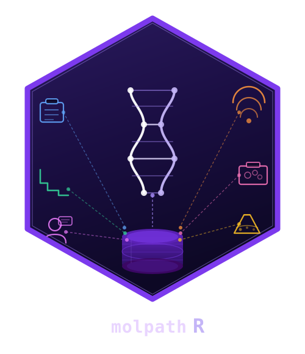

<!-- README.md is generated from README.Rmd. Please edit that file -->

```{r, include = FALSE}
knitr::opts_chunk$set(
  collapse = TRUE,
  comment = "#>",
  fig.path = "man/figures/README-",
  out.width = "100%"
)
```

# molpathR 

<!-- badges: start -->
[](https://github.com/r-heller/molpathR/actions/workflows/R-CMD-check.yaml)
[](https://r-heller.github.io/molpathR/)
[](https://CRAN.R-project.org/package=molpathR)
[](https://app.codecov.io/gh/r-heller/molpathR?branch=main)
[](https://cran.r-project.org/package=molpathR)
[](https://cran.r-project.org/package=molpathR)
[](https://opensource.org/licenses/MIT)
[](https://lifecycle.r-lib.org/articles/stages.html#experimental)
<!-- badges: end -->

**molpathR** is a unified molecular pathology data platform that ingests
heterogeneous clinical and genomic data sources (VCF, BAM, FASTQ, XML reports,
PDF reports, clinical information systems, survival data), builds a queryable
in-memory database, and provides an interactive Shiny application for clinical
exploration and visualization.

## Installation

Install the development version from GitHub:

```{r install, eval = FALSE}
# install.packages("remotes")
remotes::install_github("cttir/molpathR")
```

## Quick example

```{r example}
library(molpathR)

# Load example database with synthetic data
db <- mp_example_db(n_patients = 50, seed = 42)
db

# Query pathogenic TP53 variants
tp53 <- mp_query_variants(db, genes = "TP53", classification = "Pathogenic")
head(tp53[, c("sample_id", "gene", "variant", "classification", "vaf")])
```

```{r plot, fig.width = 8, fig.height = 5}
# Survival analysis by diagnosis
mp_plot_survival(db, group_by = "diagnosis", type = "os")
```

## Launch the Shiny app

```{r shiny, eval = FALSE}
mp_run_app(db)
```

## Features

- **Parsers** for VCF, FASTQ, BAM, XML reports, PDF reports, clinical systems, and survival data
- **Relational in-memory database** linking patients, samples, variants, reports, clinical, and survival data
- **Query engine** with tidy evaluation and free-text search
- **Publication-ready plots**: variant landscapes, mutation spectra, survival curves, cohort overviews
- **Interactive Shiny application** with 6 tabs for clinical exploration

## Documentation

- [Getting Started](https://cttir.github.io/molpathR/articles/getting-started.html)
- [Data Import Guide](https://cttir.github.io/molpathR/articles/data-import.html)
- [Visualization Guide](https://cttir.github.io/molpathR/articles/visualization.html)
- [Shiny Application](https://cttir.github.io/molpathR/articles/shiny-app.html)

## Use of LLM tools

Portions of this package were prepared with assistance from large language model tooling for
narrowly defined, non-authorial tasks: copyediting, prose smoothing, Markdown/LaTeX formatting,
scaffolding of boilerplate files (CI configs, build scripts), code refactoring. The tools used were [Chat AI](https://kisski.gwdg.de/leistungen/2-02-llm-service/),
the LLM service of KISSKI (GWDG), and a self-hosted **Mistral Small (24B, Apache-2.0)** run locally via
[Ollama](https://ollama.com/) and the `ollamar` R package — local inference only, with no data sent to
third parties for the self-hosted model.

All scientific claims, methodological choices, analyses, interpretations, and conclusions are the
author's own. No LLM-generated text was incorporated without review and revision, and every reference
was verified against its DOI, arXiv ID, or ISBN.

## License

MIT License. See [LICENSE.md](LICENSE.md) for details.
