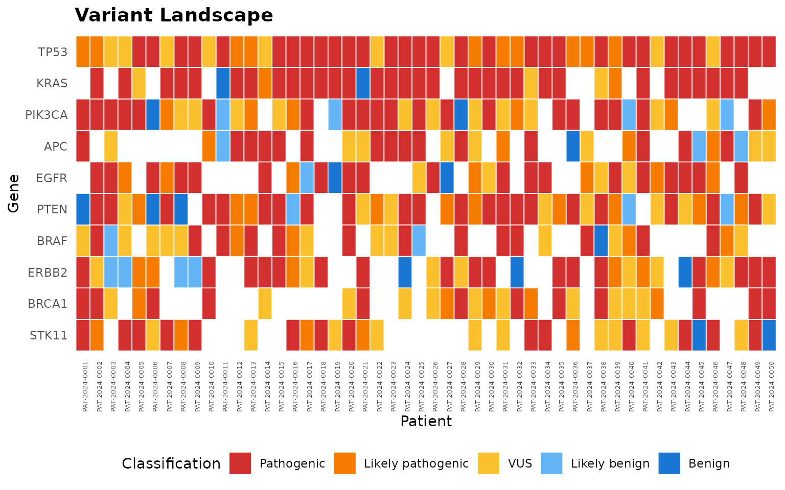
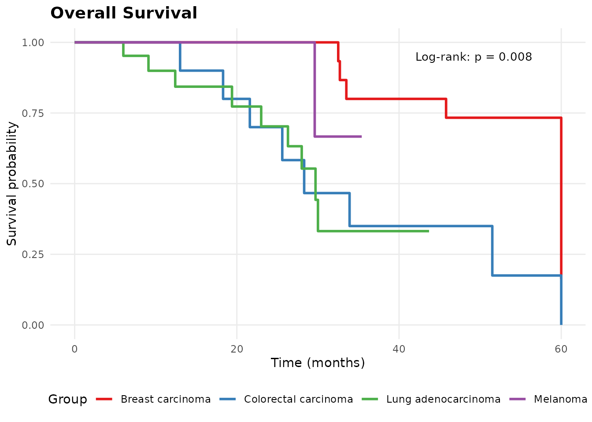

# Getting Started with molpathR

## Installation

Install molpathR from GitHub:

``` r

# install.packages("remotes")
remotes::install_github("r-heller/molpathR")
```

## Quick start

Load the package and create an example database:

``` r

library(molpathR)
db <- mp_example_db(n_patients = 50, seed = 42)
db
#> 
#> ── molpath_db ──────────────────────────────────────────────────────────────────
#> ℹ patients: 50 records x 5 columns
#> ℹ samples: 116 records x 5 columns
#> ℹ variants: 2151 records x 10 columns
#> ℹ reports: 116 records x 5 columns
#> ℹ clinical: 195 records x 5 columns
#> ℹ survival: 50 records x 5 columns
#> ℹ Sample date range: 2021-04-01 to 2025-06-26
#> ℹ Overall completeness: "93.7%"
#> ℹ Created: "2026-05-04 18:30:58"
#> ℹ Source files: 0
```

## Explore the data

Get a cohort summary:

``` r

mp_summary(db)
#> 
#> ── molpathR Database Summary ───────────────────────────────────────────────────
#> 
#> ── Record counts ──
#> 
#> • Patients: 50
#> • Samples: 116
#> • Variants: 2151
#> • Reports: 116
#> • Clinical: 195
#> 
#> ── Diagnoses ──
#> 
#> • Breast carcinoma: 15
#> • Colorectal carcinoma: 10
#> • Lung adenocarcinoma: 21
#> • Melanoma: 4
#> 
#> ── Top mutated genes ──
#> 
#> • TP53: 272
#> • KRAS: 241
#> • PIK3CA: 173
#> • APC: 138
#> • EGFR: 138
#> • PTEN: 122
#> • BRAF: 119
#> • ERBB2: 97
#> • BRCA1: 86
#> • STK11: 85
#> 
#> ── Completeness ──
#> 
#> • patients_with_samples: 100%
#> • patients_with_variants: 100%
#> • patients_with_survival: 100%
#> • patients_with_clinical: 100%
```

## Query patients

``` r

# Find melanoma patients over 60
melanoma <- mp_query_patients(db, diagnosis == "Melanoma", age > 60)
head(melanoma)
#> # A tibble: 3 × 5
#>   patient_id      age sex   diagnosis diagnosis_date
#>   <chr>         <int> <chr> <chr>     <date>        
#> 1 PAT-2024-0011    77 F     Melanoma  2023-06-25    
#> 2 PAT-2024-0031    67 M     Melanoma  2021-07-20    
#> 3 PAT-2024-0032    70 F     Melanoma  2024-11-25
```

## Query variants

``` r

# Pathogenic TP53 variants with VAF > 10%
tp53 <- mp_query_variants(db, genes = "TP53", classification = "Pathogenic", min_vaf = 0.1)
head(tp53)
#> # A tibble: 6 × 10
#>   sample_id  gene  variant variant_type classification   vaf chromosome position
#>   <chr>      <chr> <chr>   <chr>        <chr>          <dbl> <chr>         <int>
#> 1 SAM-2022-… TP53  p.G245S SNV          Benign         0.216 17           3.53e6
#> 2 SAM-2022-… TP53  c.787_… Indel        VUS            0.650 17           2.83e7
#> 3 SAM-2022-… TP53  p.R282W SNV          Likely pathog… 0.402 17           1.55e7
#> 4 SAM-2022-… TP53  p.Y220C SNV          Likely pathog… 0.248 17           1.47e8
#> 5 SAM-2023-… TP53  p.C176Y SNV          VUS            0.328 17           4.63e7
#> 6 SAM-2024-… TP53  p.R175H SNV          VUS            0.202 17           3.50e7
#> # ℹ 2 more variables: ref_allele <chr>, alt_allele <chr>
```

## Visualize

``` r

mp_plot_variant_landscape(db, top_n = 10)
```



``` r

mp_plot_survival(db, group_by = "diagnosis", type = "os")
```



## Launch the Shiny app

``` r

mp_run_app(db)
```
