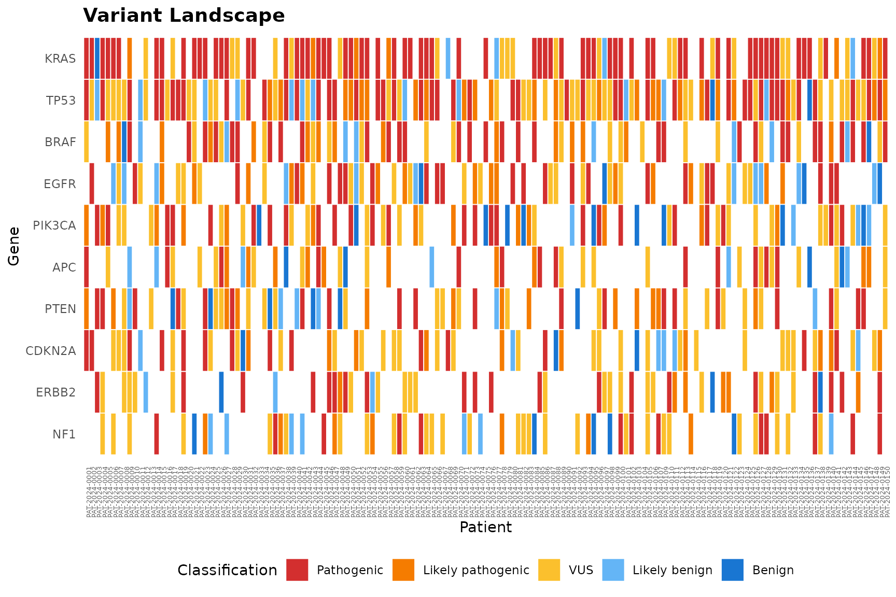
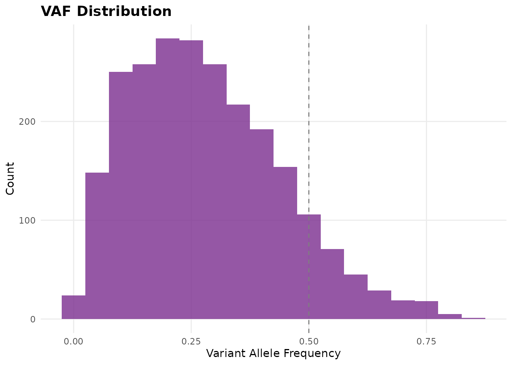
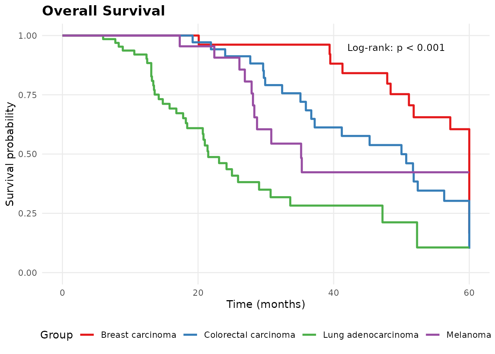
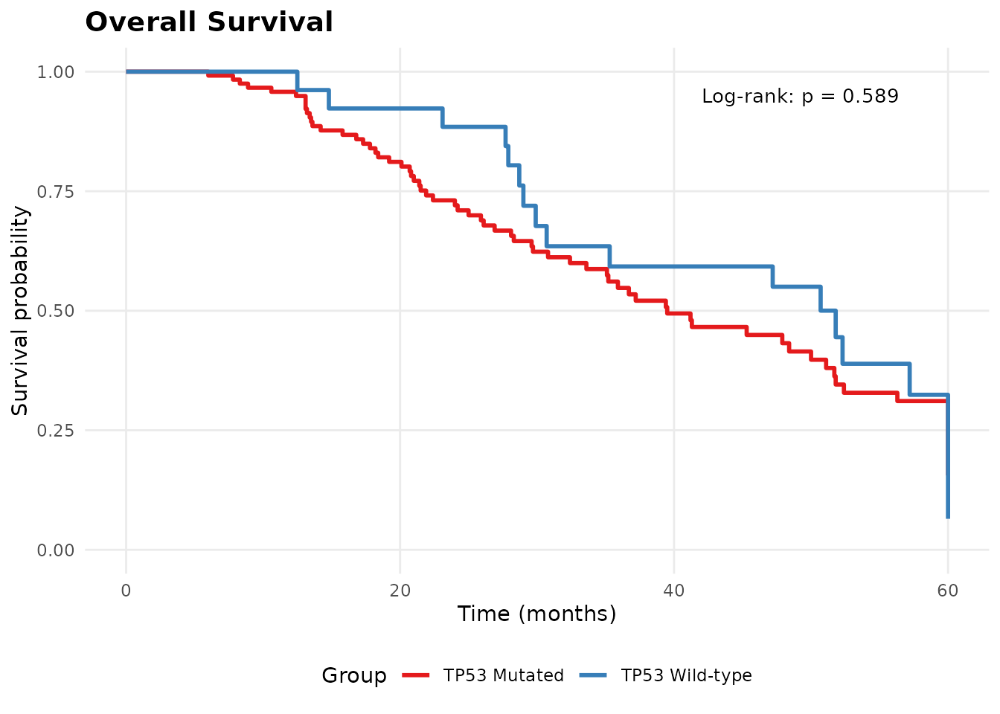
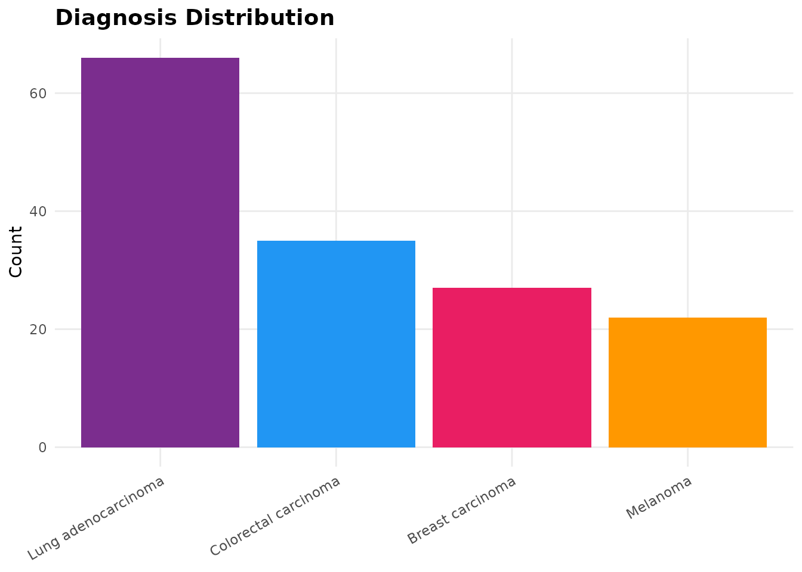
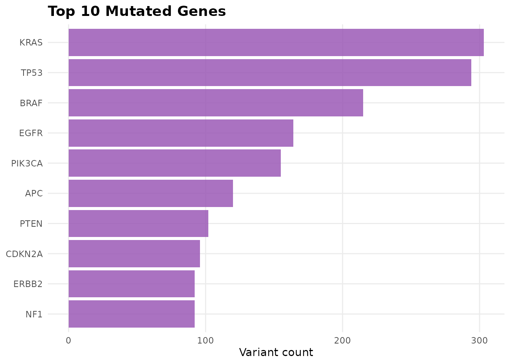
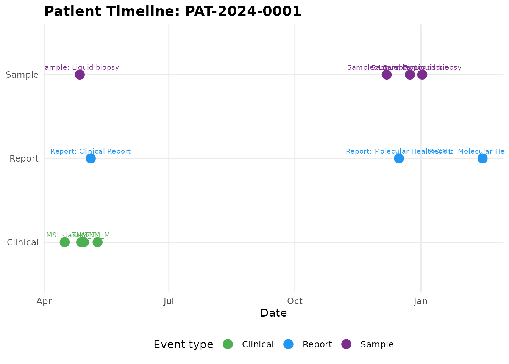
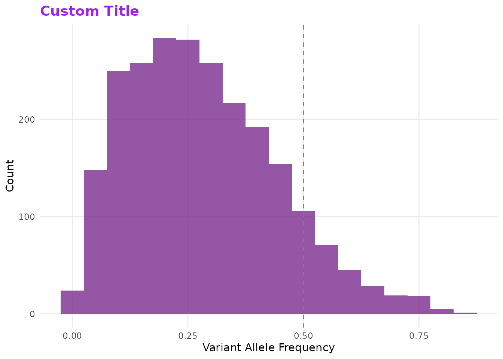

# Visualization Guide

## Overview

All molpathR plot functions return ggplot2 objects, so you can customize
them with standard ggplot2 syntax.

``` r
library(molpathR)
db <- mp_example_db(n_patients = 150, seed = 42)
```

## Variant landscape

``` r
mp_plot_variant_landscape(db, top_n = 10)
```



## VAF distribution

``` r
mp_plot_vaf_distribution(db, gene = "TP53")
```



## Survival analysis

``` r
# Overall survival by diagnosis
mp_plot_survival(db, group_by = "diagnosis", type = "os")
```



``` r
# Stratify by TP53 mutation status
mp_plot_survival(db, group_by = "TP53", type = "os")
```



## Cohort overview

``` r
plots <- mp_plot_cohort_overview(db)
plots$diagnosis
```



``` r
plots$top_genes
```



## Patient timeline

``` r
pid <- db$patients$patient_id[1]
mp_plot_timeline(db, pid)
```



## Customization

All plots can be customized with ggplot2:

``` r
library(ggplot2)
mp_plot_vaf_distribution(db) +
  labs(title = "Custom Title") +
  theme(plot.title = element_text(colour = "purple"))
```


