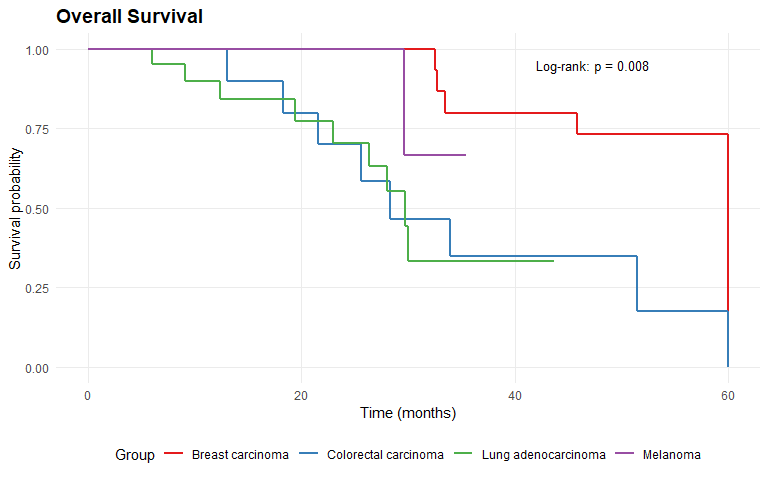

# molpathR

**molpathR** is a unified molecular pathology data platform that ingests
heterogeneous clinical and genomic data sources (VCF, BAM, FASTQ, XML
reports, PDF reports, clinical information systems, survival data),
builds a queryable in-memory database, and provides an interactive Shiny
application for clinical exploration and visualization.

## Installation

Install the development version from GitHub:

``` r

# install.packages("remotes")
remotes::install_github("cttir/molpathR")
```

## Quick example

``` r

library(molpathR)

# Load example database with synthetic data
db <- mp_example_db(n_patients = 50, seed = 42)
db
#> 
#> ── molpath_db ──────────────────────────────────────────────────────────────────
#> ℹ patients: 50 records x 5 columns
#> ℹ samples: 116 records x 5 columns
#> ℹ variants: 2151 records x 10 columns
#> ℹ reports: 116 records x 5 columns
#> ℹ clinical: 195 records x 5 columns
#> ℹ survival: 50 records x 5 columns
#> ℹ Sample date range: 2021-04-01 to 2025-06-26
#> ℹ Overall completeness: "93.7%"
#> ℹ Created: "2026-06-22 13:47:32"
#> ℹ Source files: 0

# Query pathogenic TP53 variants
tp53 <- mp_query_variants(db, genes = "TP53", classification = "Pathogenic")
head(tp53[, c("sample_id", "gene", "variant", "classification", "vaf")])
#> # A tibble: 6 × 5
#>   sample_id     gene  variant             classification   vaf
#>   <chr>         <chr> <chr>               <chr>          <dbl>
#> 1 SAM-2021-0010 TP53  TP53 deletion       Pathogenic     0.420
#> 2 SAM-2021-0011 TP53  TP53-UNKNOWN fusion Pathogenic     0.464
#> 3 SAM-2022-0013 TP53  TP53-UNKNOWN fusion Pathogenic     0.322
#> 4 SAM-2021-0017 TP53  TP53 loss           Pathogenic     0.214
#> 5 SAM-2022-0018 TP53  p.R282W             Pathogenic     0.250
#> 6 SAM-2023-0020 TP53  p.R248W             Pathogenic     0.213
```

``` r

# Survival analysis by diagnosis
mp_plot_survival(db, group_by = "diagnosis", type = "os")
```



## Launch the Shiny app

``` r

mp_run_app(db)
```

## Features

- **Parsers** for VCF, FASTQ, BAM, XML reports, PDF reports, clinical
  systems, and survival data
- **Relational in-memory database** linking patients, samples, variants,
  reports, clinical, and survival data
- **Query engine** with tidy evaluation and free-text search
- **Publication-ready plots**: variant landscapes, mutation spectra,
  survival curves, cohort overviews
- **Interactive Shiny application** with 6 tabs for clinical exploration

## Documentation

- [Getting
  Started](https://cttir.github.io/molpathR/articles/getting-started.html)
- [Data Import
  Guide](https://cttir.github.io/molpathR/articles/data-import.html)
- [Visualization
  Guide](https://cttir.github.io/molpathR/articles/visualization.html)
- [Shiny
  Application](https://cttir.github.io/molpathR/articles/shiny-app.html)

## Use of LLM tools

Portions of this package were prepared with assistance from large
language model tooling for narrowly defined, non-authorial tasks:
copyediting, prose smoothing, Markdown/LaTeX formatting, scaffolding of
boilerplate files (CI configs, build scripts), code refactoring. The
tools used were [Chat
AI](https://kisski.gwdg.de/leistungen/2-02-llm-service/), the LLM
service of KISSKI (GWDG), and a self-hosted **Mistral Small (24B,
Apache-2.0)** run locally via [Ollama](https://ollama.com/) and the
`ollamar` R package — local inference only, with no data sent to third
parties for the self-hosted model.

All scientific claims, methodological choices, analyses,
interpretations, and conclusions are the author’s own. No LLM-generated
text was incorporated without review and revision, and every reference
was verified against its DOI, arXiv ID, or ISBN.

## License

MIT License. See
[LICENSE.md](https://cttir.github.io/molpathR/LICENSE.md) for details.
